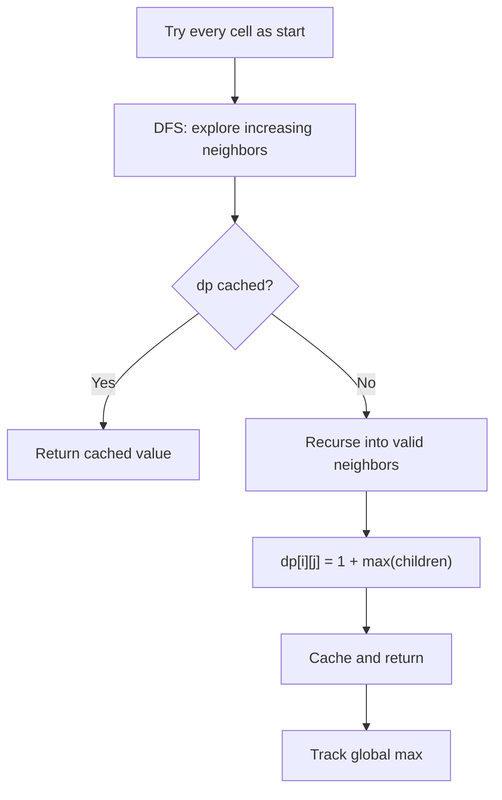

# Longest Increasing Path in a Matrix

## Problem
- `m x n` integer matrix, find length of **longest strictly increasing path**
- Move in 4 directions (no diagonal)
- Can start from any cell

## Pattern
**DFS + Memoization on a grid** — every cell caches the longest path starting from it

> [!tip]
> No visited array needed — the "strictly increasing" constraint prevents cycles naturally

## Approach
- For every cell, run DFS exploring all 4 neighbors where `neighbor > current`
- `dp[i][j]` = longest increasing path starting from cell `(i, j)`
- If `dp[i][j]` already computed, return it immediately (memo hit)
- At each cell: `dp[i][j] = 1 + max(dfs(valid neighbors))`
- Track global max across all starting cells

## Pseudocode
```
dp[m][n] = all zeros

function dfs(i, j):
    if dp[i][j] != 0: return dp[i][j]   // memo hit
    dp[i][j] = 1                         // at minimum, the cell itself
    for each of 4 directions:
        (ni, nj) = neighbor
        if in bounds AND matrix[ni][nj] > matrix[i][j]:
            dp[i][j] = max(dp[i][j], 1 + dfs(ni, nj))
    return dp[i][j]

ans = 0
for every cell (i, j):
    ans = max(ans, dfs(i, j))
return ans
```

## Diagram


## Pitfalls
> [!danger]
> Using `+=` to aggregate neighbor paths — this **sums** all paths instead of picking the **longest**. A cell with two neighbors (lengths 3 and 5) should give `1 + 5 = 6`, not `1 + 3 + 5 = 9`

> [!warning]
> Making DFS `void` instead of returning `int` — without a return value, the parent cell has no way to know the result of children. The memoization pattern requires DFS to **return** the cached value

> [!warning]
> `ans = max(dp[i][j], dfs(...))` instead of `ans = max(ans, dfs(...))` — loses the running global maximum; only keeps the last cell's result

## Key Insight
> [!note]
> Starting from the smallest element is not required. Memoization means even if you start from a "bad" cell first, its result gets cached and reused when a "good" starting cell's DFS passes through it later. Every cell is visited at most once across all DFS calls.

## Mnemonic
"Return and cache — max, not stack."
