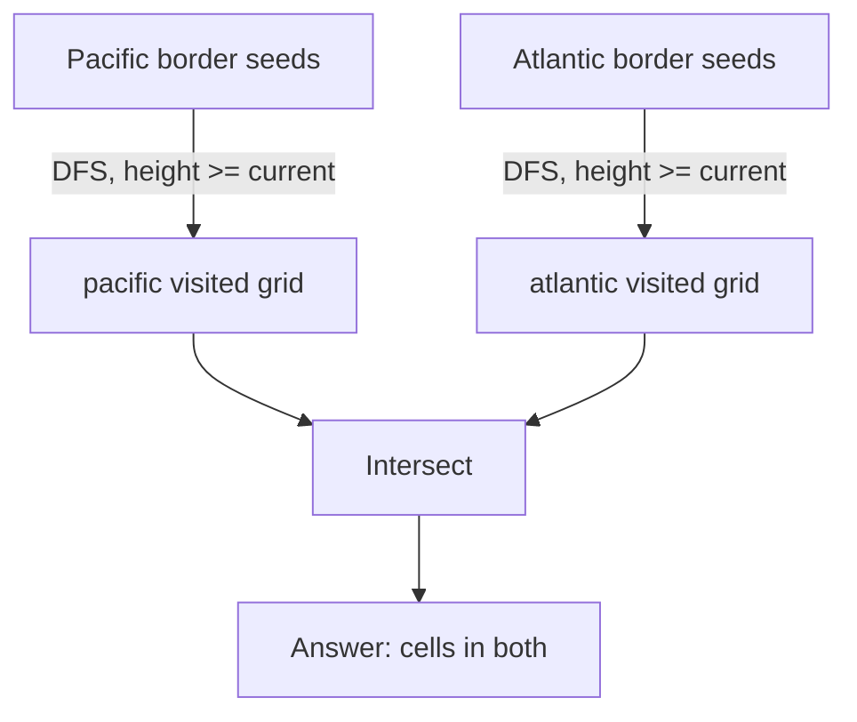

# Pacific Atlantic Water Flow

## Problem
- Grid of heights. Pacific touches top + left edge, Atlantic touches bottom + right edge
- Water flows from a cell to a neighbor only if `height[neighbor] <= height[current]`
- Find all cells that can flow to **both** oceans

## Pattern
**Multi-source boundary DFS/BFS — reverse flow from the edges**

> [!tip]
> Flip the direction: instead of testing "can this cell reach the ocean," start at the ocean's border and walk backward. Reversing "downhill" gives `height[neighbor] >= height[current]`.

## Approach
- Two independent visited grids: `pacific`, `atlantic`
- Seed Pacific from row 0 + column 0, seed Atlantic from last row + last column
- DFS (or BFS) outward under the reversed `>=` rule
- Answer = cells present in both visited grids

> [!warning]
> `>=` not `>` — water can flow across equal height (flat ground). Strict `>` misses valid plateau paths.

## Pseudocode
```
function dfs(r, c, visited, heights):
    visited[r][c] = true
    for each of 4 directions:
        (nr, nc) = neighbor
        if out of bounds: continue
        if visited[nr][nc]: continue
        if heights[nr][nc] < heights[r][c]: continue
        dfs(nr, nc, visited, heights)

pacific = grid of false, atlantic = grid of false

for each cell in row 0 and column 0:
    dfs(cell, pacific, heights)
for each cell in last row and last column:
    dfs(cell, atlantic, heights)

result = []
for each cell (r, c):
    if pacific[r][c] and atlantic[r][c]:
        result.add((r, c))
return result
```

## Diagram


## Pitfalls
> [!danger]
> No backtracking / un-marking here — this is reachability only, not path enumeration. Unmarking would cause infinite recursion.

> [!warning]
> The two passes never interact mid-algorithm — Pacific and Atlantic traversals are fully independent. They only meet in the final intersection loop.

## Complexity
| | Time | Space |
|---|---|---|
| Each traversal | O(n·m) | O(n·m) visited grid |
| Total | O(n·m) | O(n·m) |

## Mnemonic
"Flip the flow, seed the shore, meet in the middle only at the end."
