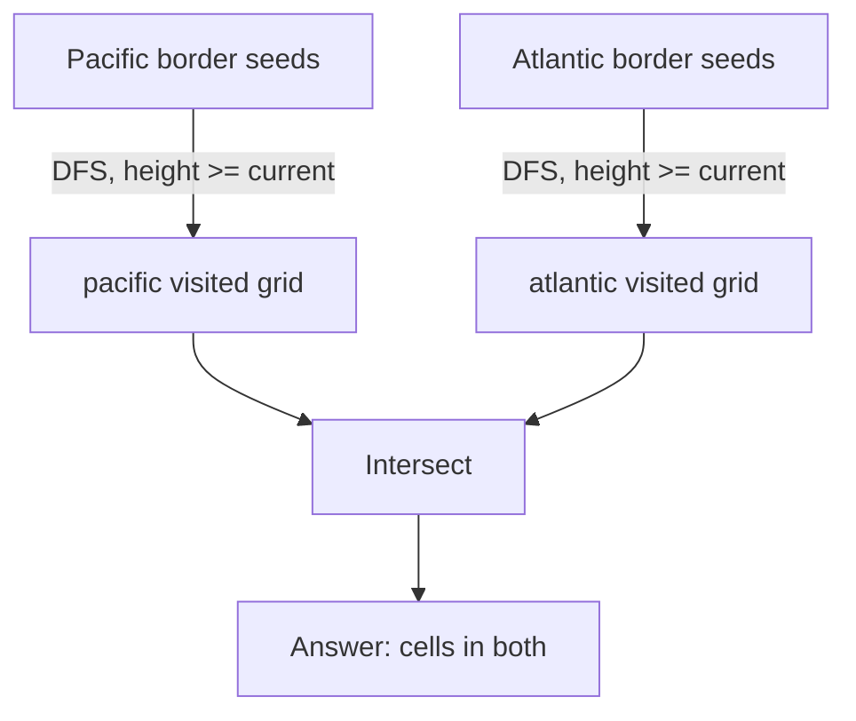
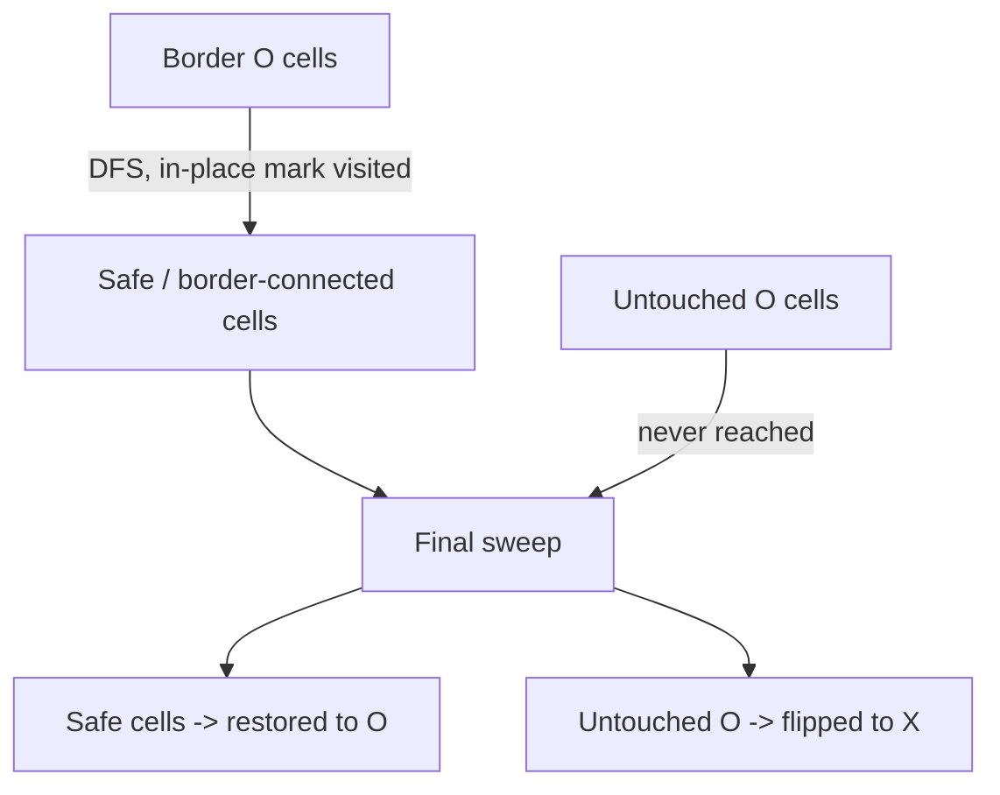

# Pacific Atlantic Water Flow

## Problem
- Grid of heights. Pacific touches top + left edge, Atlantic touches bottom + right edge
- Water flows from a cell to a neighbor only if `height[neighbor] <= height[current]`
- Find all cells that can flow to **both** oceans

## Pattern
**Multi-source boundary DFS/BFS — reverse flow from the edges**

> [!tip]
> Flip the direction: instead of testing "can this cell reach the ocean," start at the ocean's border and walk backward. Reversing "downhill" gives `height[neighbor] >= height[current]`.

## Approach
- Two independent visited grids: `pacific`, `atlantic`
- Seed Pacific from row 0 + column 0, seed Atlantic from last row + last column
- DFS (or BFS) outward under the reversed `>=` rule
- Answer = cells present in both visited grids

> [!warning]
> `>=` not `>` — water can flow across equal height (flat ground). Strict `>` misses valid plateau paths.

## Pseudocode
```
function dfs(r, c, visited, heights):
    visited[r][c] = true
    for each of 4 directions:
        (nr, nc) = neighbor
        if out of bounds: continue
        if visited[nr][nc]: continue
        if heights[nr][nc] < heights[r][c]: continue
        dfs(nr, nc, visited, heights)

pacific = grid of false, atlantic = grid of false

for each cell in row 0 and column 0:
    dfs(cell, pacific, heights)
for each cell in last row and last column:
    dfs(cell, atlantic, heights)

result = []
for each cell (r, c):
    if pacific[r][c] and atlantic[r][c]:
        result.add((r, c))
return result
```

## Diagram


## Pitfalls
> [!danger]
> No backtracking / un-marking here — this is reachability only, not path enumeration. Unmarking would cause infinite recursion.

> [!warning]
> The two passes never interact mid-algorithm — Pacific and Atlantic traversals are fully independent. They only meet in the final intersection loop.

## Complexity
| | Time | Space |
|---|---|---|
| Each traversal | O(n·m) | O(n·m) visited grid |
| Total | O(n·m) | O(n·m) |

## Mnemonic
"Flip the flow, seed the shore, meet in the middle only at the end."

---

# Surrounded Regions

## Problem
- Board of `X` and `O`. Capture (flip to `X`) every `O` region fully enclosed by `X`
- An `O` region survives if it touches the border, directly or via a connected chain of other `O`s
- Connectivity is transitive — one border-touching cell saves the entire connected component, however far from the edge

## Pattern
**Multi-source boundary DFS/BFS — mark border-connected cells as safe, capture everything else**

> [!tip]
> Same shape as Pacific Atlantic: don't test each cell outward, seed from the border and flood inward. Here it's a single safe/unsafe flag instead of two ocean grids.

## Approach
- Pass 1: DFS/BFS from every `O` sitting on the border, mark each reached cell in-place (e.g. overwrite `O` → `Y`) as it's visited
- Pass 2: single sweep over the whole grid — remaining `O` (never reached) → `X`; `Y` (reached) → restore to `O`; `X` untouched
- In-place marking during the flood-fill doubles as the visited check, so no separate visited grid is needed here (unlike Pacific Atlantic's two grids)

## Pseudocode
```
function dfs(r, c, board):
    board[r][c] = 'Y'   // mark visited/safe
    for each of 4 directions:
        (nr, nc) = neighbor
        if out of bounds: continue
        if board[nr][nc] != 'O': continue
        dfs(nr, nc, board)

for each cell on the border:
    if board[cell] == 'O': dfs(cell, board)

for each cell (r, c):
    if board[r][c] == 'O': board[r][c] = 'X'
    else if board[r][c] == 'Y': board[r][c] = 'O'
```

## Diagram


## Pitfalls
> [!danger]
> Recursive DFS stack depth is NOT O(1) — worst case (one long snake-shaped `O` region) recursion depth is O(n·m). Java's default stack is smaller than C++'s, so this risks `StackOverflowError` on large grids; be ready to say you'd switch to BFS or an explicit-stack DFS if pressed.

> [!warning]
> The border loop must cover all four edges including corners — top row, bottom row, left column, right column.

## Complexity
| | Time | Space |
|---|---|---|
| Border DFS (all cells combined) | O(n·m) | O(n·m) recursion stack (worst case) |
| Final sweep | O(n·m) | O(1) extra |
| Total | O(n·m) | O(n·m) worst case, not O(1) |

## Mnemonic
"Touch the border, you're safe forever — everything else gets swallowed."

---

## Pattern comparison — boundary-seeded flood-fill

| | Pacific Atlantic Water Flow | Surrounded Regions |
|---|---|---|
| What's seeded | Two borders (Pacific edges, Atlantic edges) | One border (all four edges together) |
| Visited tracking | Two separate visited grids | Single in-place marker on the board itself |
| Move rule | `height[neighbor] >= height[current]` (reversed downhill) | Just `board[neighbor] == 'O'` (no ordering constraint) |
| Final answer | Intersection of the two visited grids | Everything reached = keep; everything else = flip |
| Core reused idea | Seed from the edge, walk inward, skip re-testing every cell from scratch | same |

> [!tip]
> Mnemonic for the family: "When a problem cares about border-reachability, flood-fill FROM the border — don't probe TOWARD it from every cell."
