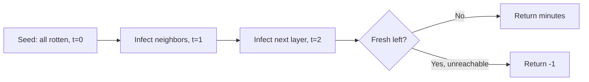

# Rotting Oranges

## Problem
- Grid: `0` empty, `1` fresh, `2` rotten
- Every minute, rotten infects orthogonally adjacent fresh oranges
- Return minutes until no fresh orange remains, or `-1` if impossible

## Pattern
Same shape as Walls and Gates — **multi-source BFS**, minute = distance

## Approach
- Seed queue with all rotten oranges at minute 0
- BFS outward one full layer per minute
- After BFS drains, scan for leftover fresh oranges → if any, return -1

## Pseudocode
```
queue = all cells where grid[r][c] == 2
freshCount = count of cells == 1
minutes = 0

while queue not empty:
    layerSize = size of queue
    infectedThisRound = false
    repeat layerSize times:
        (r, c) = pop front
        for each of 4 directions:
            (nr, nc) = neighbor
            if out of bounds or grid[nr][nc] != 1: continue
            grid[nr][nc] = 2
            freshCount -= 1
            push (nr, nc)
            infectedThisRound = true
    if infectedThisRound: minutes += 1

return freshCount == 0 ? minutes : -1
```

## Diagram


## Pitfalls
> [!warning]
> Increment minutes once per full layer, not per cell — process the whole frontier before bumping the counter

> [!danger]
> Skipping the final "any fresh left?" check → wrong answer whenever an orange is walled off and unreachable

## Mnemonic
"Same wave, different exit condition."
