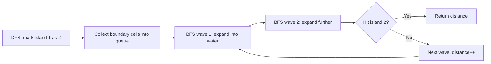

# Shortest Bridge

## Problem
- Binary grid with exactly two islands (connected components of `1`s)
- Flip minimum number of `0`s to connect them
- Return the minimum flips

## Pattern
**DFS to find + Multi-source BFS to expand** — two-phase approach

## Approach
- **Phase 1:** Find one island via DFS, mark all its cells as `2`. While marking, push boundary cells (cells with at least one `0` neighbor) into a queue
- **Phase 2:** Multi-source BFS from all boundary cells simultaneously. Expand through water (`0`s), marking visited as `2`. Stop the moment any expansion hits a `1` (the second island)
- BFS level count = bridge length = answer

## Pseudocode
```
// Phase 1: DFS to find & mark first island
function dfs(i, j):
    grid[i][j] = 2
    for each of 4 directions:
        if neighbor is 0: push (i, j) to queue  // boundary cell
        if neighbor is 1: dfs(neighbor)

// Find first 1 and kick off DFS
for each cell: if grid[i][j] == 1: dfs(i, j); break both loops

// Phase 2: Multi-source BFS
distance = 0
while queue not empty:
    layerSize = size of queue
    repeat layerSize times:
        (r, c) = pop front
        for each of 4 directions:
            if neighbor == 1: return distance   // hit island 2
            if neighbor == 0:
                grid[nr][nc] = 2                // mark visited
                push (nr, nc)
    distance += 1
```

## Diagram


## Pitfalls
> [!danger]
> Forgetting to mark water cells as visited (`grid[nr][nc] = 2`) when pushing to queue — causes the same cell to be pushed and processed multiple times, breaks level-count guarantee

> [!warning]
> Breaking out of nested loops — a single `break` only exits the inner loop. Use a `found` flag or `goto` to exit both

> [!note]
> Boundary cells with multiple water neighbors can get pushed into the queue multiple times during DFS. Not a correctness bug (they're already marked `2`) but causes redundant work

## Mnemonic
"DFS to claim, BFS to bridge."
