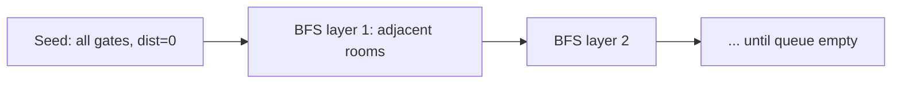

# Walls and Gates (Islands and Treasure)

## Problem
- Grid cells: `0` = gate/treasure, `-1` = wall, `INF` = empty room
- Fill every empty room with distance to nearest gate, in place

## Pattern
**Multi-source BFS** — seed all gates at once, distances fill in correctly by construction

> [!tip]
> First visit in multi-source BFS = shortest distance, always. Never revisit or "correct" a distance later.

## Approach
- Push every `0` cell into the queue at distance 0
- BFS outward layer by layer
- Only write a distance and push a cell if it's still `INF` — that's the visited check

## Pseudocode
```
queue = all cells where grid[r][c] == 0

while queue not empty:
    (r, c, dist) = pop front
    for each of 4 directions:
        (nr, nc) = neighbor
        if out of bounds or grid[nr][nc] == WALL: continue
        if grid[nr][nc] != INF: continue
        grid[nr][nc] = dist + 1
        push (nr, nc, dist + 1)
```

## Diagram


## Pitfalls
> [!danger]
> Pushing a neighbor before checking whether it's still `INF` → cell gets revisited/overwritten, queue never drains (real bug hit while solving this)

> [!warning]
> `&` instead of `&&` in the bounds check — compiles fine on bools, silently wrong

## Mnemonic
"Visited once = correct forever."
