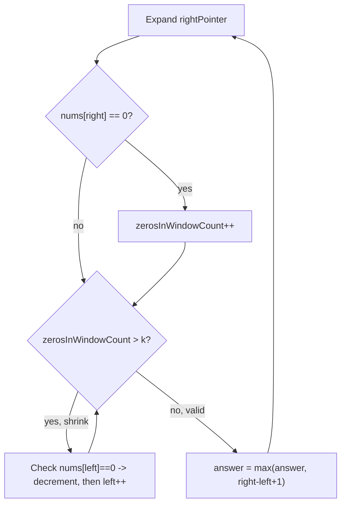

# Max Consecutive Ones III

## Problem
- Binary array `nums`, integer `k`
- Can flip at most `k` zeros to ones
- Find the length of the longest contiguous subarray of all 1s achievable after flipping

## Pattern
**Variable-size sliding window — exact/valid shrink (not stale, unlike Character Replacement)**

> [!tip]
> Contrast with Longest Repeating Character Replacement: that problem's shrink is a *lower-bound* (maxFreq never decrements, window size never regresses but composition can go stale). This problem's shrink is *exact* — after shrinking, the window is always genuinely valid (`zerosInWindow <= k`), because the zero-count is decremented precisely and correctly as elements leave.

## Approach
- Two pointers, `leftPointer` and `rightPointer`, both starting at 0 — window is `[leftPointer, rightPointer]` inclusive
- `zerosInWindowCount` tracks how many zeros are currently inside the window
- Expand `rightPointer` one step at a time; if the newly included element is `0`, increment `zerosInWindowCount`
- While `zerosInWindowCount > k`: window is invalid — shrink from the left. Only decrement `zerosInWindowCount` when the element actually leaving (`nums[leftPointer]`) is itself a `0`; then advance `leftPointer`
- After the shrink-while-loop settles (window is guaranteed valid again), record `answer = max(answer, rightPointer - leftPointer + 1)`

> [!danger]
> Placement bug (real bug hit while solving): computing `answer` at the TOP of the loop, before folding in `nums[rightPointer]` and before the shrink-while-loop runs, measures the *previous* iteration's window — one step stale. Must compute `answer` AFTER both the zero-count update and the shrink-while-loop have run for the current `rightPointer`.

> [!warning]
> Only decrement `zerosInWindowCount` when the departing element is actually a `0`. Decrementing unconditionally on every left-pointer step is wrong — a `1` leaving the window doesn't free up a flip.

## Pseudocode
```
leftPointer = 0
zerosInWindowCount = 0
answer = 0

for rightPointer from 0 to n-1:
    if nums[rightPointer] == 0:
        zerosInWindowCount += 1

    while zerosInWindowCount > k:
        if nums[leftPointer] == 0:
            zerosInWindowCount -= 1
        leftPointer += 1

    answer = max(answer, rightPointer - leftPointer + 1)

return answer
```

## Diagram


## Pitfalls
> [!warning]
> Window size formula after the shrink-loop settles is `rightPointer - leftPointer + 1` (inclusive count) — easy to drop the `+1` and undercount by one.

## Complexity
| | Time | Space |
|---|---|---|
| Total | O(n) — each pointer moves forward at most n times total | O(1) |

## Mnemonic
"Zero leaves, count leaves — everything else, the window stays honest."
