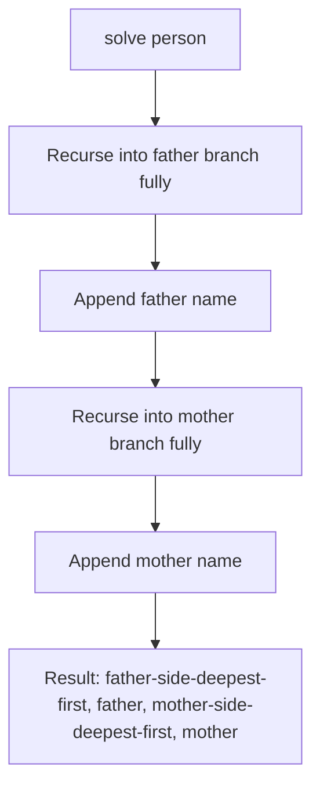

# Family Hierarchy — Find Ancestors

## Problem
- Given `n` relationships in format `(Father, Mother, Child)`, and a target `person`
- Return all ancestors of `person`: father's side ancestors first, then father himself, then mother's side ancestors, then mother herself
- Build a `Map<child, [father, mother]>` from the input, then recurse upward from `person`

## Pattern
**Recursive tree traversal — sequential (not interleaved) recursion for automatic branch grouping**

> [!tip]
> When output needs to be grouped by branch/subtree (all of father's side, THEN all of mother's side — not merged/interleaved), do full sequential recursion into one branch before touching the next. The call order alone produces the grouping — no need to tag nodes as "father-side"/"mother-side" and merge two lists afterward.

## Approach
- Map each child → `[father, mother]` from the input relationships
- Recurse from `person`: base case = person not in map (no recorded parents, i.e. a root ancestor)
- Recursive case: fully recurse into father branch first → then append father's own name → fully recurse into mother branch → then append mother's own name
- Appending AFTER the recursive call (not before) gives deepest-ancestor-first order within each branch (postorder). Appending BEFORE the call would give nearest-ancestor-first (preorder) instead — know which one is asked for.

## Pseudocode
```
function solve(personName, parentMap, resultList):
    if personName not in parentMap:
        return resultList          // root ancestor, no further parents recorded

    father = parentMap[personName][0]
    mother = parentMap[personName][1]

    solve(father, parentMap, resultList)   // fully resolve father's side first
    resultList.add(father)

    solve(mother, parentMap, resultList)   // then fully resolve mother's side
    resultList.add(mother)

    return resultList

// build parentMap: for each relationship line (father, mother, child):
//     parentMap[child] = [father, mother]

// call: solve(targetPerson, parentMap, emptyList)
```

## Diagram


## Pitfalls
> [!warning]
> Order of the two recursive calls (father branch before mother branch) is what creates the grouping. Swapping the call order silently flips which side prints first.

> [!warning]
> Append-after-recurse (postorder) = deepest ancestor first within a branch. If a variant asks for nearest-ancestor-first instead, move the `append` line to BEFORE the recursive call (preorder) — don't restructure the whole function.

> [!danger]
> Any time input format is being decoded via fixed indices (`relation[0]`, `relation[1]`, `relation[2]`), state the assumed format out loud before coding ("index 0 = father, 1 = mother, 2 = child") — silently hardcoding an unverified index order is the highest-risk failure mode on tree/graph problems with structured multi-field input, even when it happens to be correct.

## Complexity
| | Time | Space |
|---|---|---|
| Map build | O(n) | O(n) |
| Traversal | O(depth of ancestor chain for `person`) | O(depth) recursion stack |
| Total | O(n) | O(n) |

## Mnemonic
"Finish one branch completely before starting the next — order of calls IS the grouping."
