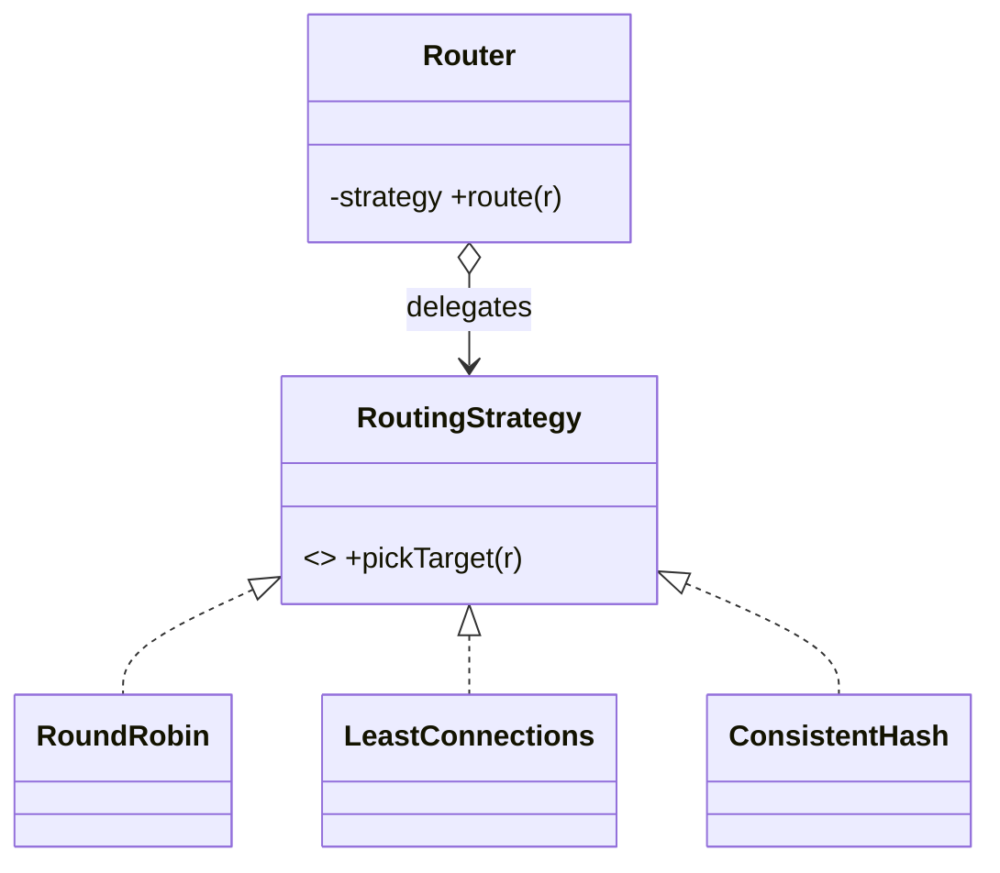
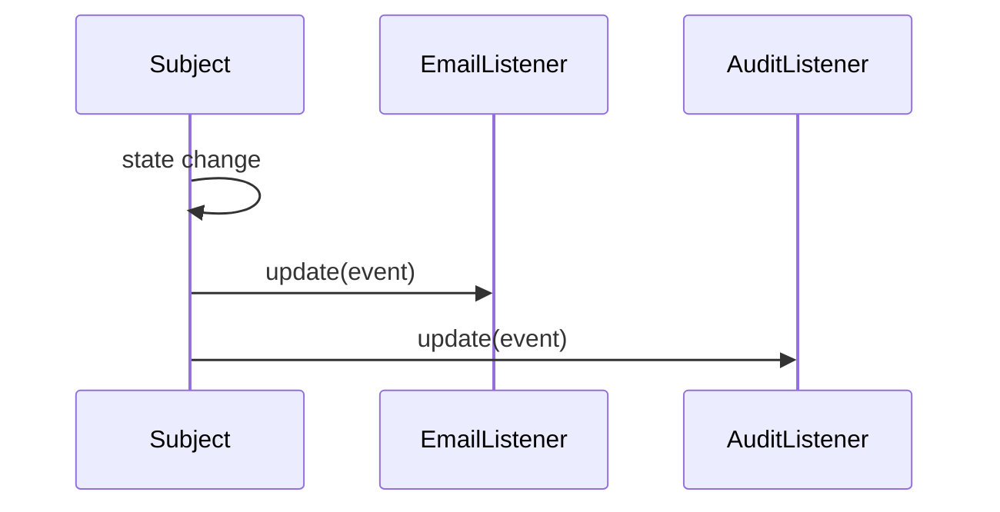
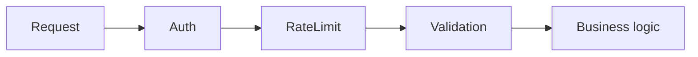

# Behavioral Patterns

Concern: **how objects interact & distribute responsibility** — algorithms, notifications, request handling.

---

## Strategy

**Problem it solves:** multiple interchangeable ways to do the **same task** (routing, pricing, compression, sorting) and you want to **pick/swap at runtime** without a growing `if/else` chain. Adding a new variant shouldn't touch existing code (Open/Closed).

**How it works:** define a common interface for the algorithm; each variant is a class; the context holds one and delegates to it.

```java
interface RoutingStrategy { String pickTarget(Request r); }

class RoundRobin      implements RoutingStrategy { public String pickTarget(Request r){ /*...*/ return "n1"; } }
class LeastConnections implements RoutingStrategy { public String pickTarget(Request r){ /*...*/ return "n2"; } }
class ConsistentHash  implements RoutingStrategy { public String pickTarget(Request r){ /*...*/ return "n3"; } }

class Router {
    private RoutingStrategy strategy;                     // swap at runtime
    Router(RoutingStrategy s){ this.strategy = s; }
    void setStrategy(RoutingStrategy s){ this.strategy = s; }
    String route(Request r){ return strategy.pickTarget(r); }  // delegates
}

Router router = new Router(new RoundRobin());
router.setStrategy(new ConsistentHash());                // change behavior live
```



> [!tip] Strategy vs if/else — when it stops being over-engineering
> Use `if/else`/`switch` when: 2–3 fixed cases, each a one-liner, rarely changes.
> Use Strategy when: **(a)** variants likely to grow, **(b)** each has real internal complexity, **(c)** must swap at **runtime** by config/input, **(d)** the branch is duplicated in several places.

| When to use | When NOT to use |
|---|---|
| Many algorithms for one job, chosen at runtime | 2–3 trivial, stable branches |
| Want to add variants without editing callers | Only one algorithm ever |

**Interview Qs**
- Strategy vs `if/else`? → the four triggers above; keyword **Open/Closed**.
- JDK example? → `Comparator` passed to `Collections.sort()` is a strategy. Thread pool `RejectedExecutionHandler`.

> Mnemonic: **Strategy = "swap the algorithm, same context."**

---

## Observer

**Problem it solves:** when one object changes, an unknown/variable set of dependents must be **notified automatically** — event listeners, UI updates, "on state change do X, Y, Z" — without the subject hard-coding who they are.

**How it works:** Subject keeps a list of Observers; on change it loops and calls each observer's callback. Observers register/unregister dynamically.

```java
interface Observer { void update(String event); }

class Subject {
    private final List<Observer> observers = new ArrayList<>();
    public void subscribe(Observer o){ observers.add(o); }
    public void unsubscribe(Observer o){ observers.remove(o); }
    protected void notifyAll(String event) {
        for (Observer o : observers) o.update(event);   // push to everyone
    }
}

class OrderService extends Subject {
    public void placeOrder(){ /*...*/ notifyAll("ORDER_PLACED"); }
}

// observers react independently:
class EmailListener implements Observer { public void update(String e){ /* send mail */ } }
class AuditListener implements Observer { public void update(String e){ /* write log */ } }
```



> [!danger] Observer vs Pub-Sub — classic confusion
> | | Observer | Pub-Sub |
> |---|---|---|
> | Coupling | Subject holds **direct refs** to observers | Broker in between; publisher & subscriber unaware of each other |
> | Sync? | Usually **synchronous**, same thread | Usually **async** |
> | Boundary | **One process / JVM** | Can cross process / network (SQS, SNS, Kafka) |
>
> **Observer = "I know your name and I call you." Pub-Sub = "I shout into a channel, don't know who's listening."**

| When to use | When NOT to use |
|---|---|
| In-process event notification, 1→many | Cross-service/async → use Pub-Sub broker |
| Loose coupling between subject & reactors | Only one, fixed dependent → direct call |

**Interview Qs**
- Observer vs Pub-Sub? → table above.
- JDK example? → old `java.util.Observer` (deprecated), `PropertyChangeListener`, Spring `ApplicationEventPublisher`.
- Risk? → memory leak if observers never unsubscribe; slow observer blocks the notify loop (synchronous).

> Mnemonic: **Observer = "subject calls its known listeners directly."**

---

## Chain of Responsibility

**Problem it solves:** a request should pass through a **series of handlers**, each of which either handles it or passes it on — validation pipelines, middleware/filters, approval chains — without the sender knowing which handler acts.

**How it works:** each handler holds a reference to the next; it does its bit, then either stops or calls `next`.

```java
abstract class Handler {
    protected Handler next;
    public Handler setNext(Handler n){ this.next = n; return n; }
    public abstract void handle(Request r);
    protected void passOn(Request r){ if (next != null) next.handle(r); }
}

class AuthHandler extends Handler {
    public void handle(Request r){
        if (!r.isAuthenticated()) throw new SecurityException("401");
        passOn(r);
    }
}
class RateLimitHandler extends Handler {
    public void handle(Request r){
        if (overLimit(r)) throw new RuntimeException("429");
        passOn(r);
    }
    private boolean overLimit(Request r){ return false; }
}
class ValidationHandler extends Handler {
    public void handle(Request r){ /* validate */ passOn(r); }
}

// wire the chain:
Handler chain = new AuthHandler();
chain.setNext(new RateLimitHandler()).setNext(new ValidationHandler());
chain.handle(request);
```



| When to use | When NOT to use |
|---|---|
| Ordered, decoupled processing steps | Single handler → no chain needed |
| Handlers added/reordered independently | Every request always needs all steps in fixed code |

**Interview Qs**
- Real example? → Servlet **Filter chain**, Spring Security filter chain, `@ControllerAdvice` closest-match resolution is chain-like.
- CoR vs Decorator? → both link objects; CoR **may stop** the chain (one handler consumes), Decorator always forwards & every layer adds behavior.

> Mnemonic: **Chain = "pass the request down until someone handles it."**

---

## Template Method

**Problem it solves:** several algorithms share the **same skeleton/steps** but differ in a few steps. Avoid duplicating the invariant flow.

**How it works:** base class defines the algorithm skeleton in a `final` method calling abstract "hook" steps; subclasses override only the varying steps.

```java
abstract class DataImporter {
    // the template — fixed order, subclasses can't change it:
    public final void importData(String path) {
        var raw = read(path);        // varies
        var clean = validate(raw);   // fixed
        save(clean);                 // varies
    }
    protected abstract String read(String path);
    protected abstract void save(String data);
    private String validate(String raw){ return raw; }   // shared step
}

class CsvImporter extends DataImporter {
    protected String read(String p){ return "csv"; }
    protected void save(String d){ /* to DB */ }
}
class JsonImporter extends DataImporter {
    protected String read(String p){ return "json"; }
    protected void save(String d){ /* to DB */ }
}
```

> [!note] Template Method vs Strategy
> Both vary an algorithm. **Template Method = inheritance** (subclass overrides steps, skeleton fixed at compile time). **Strategy = composition** (swap the whole algorithm object at runtime). Prefer Strategy when you need runtime swapping; Template Method when the skeleton is truly fixed.

| When to use | When NOT to use |
|---|---|
| Fixed process, a few variable steps | Whole algorithm varies → Strategy |
| Want to enforce step order (`final`) | Need runtime swapping |

**Interview Qs** — JDK/Spring example? → `AbstractList`, `JdbcTemplate`, `HttpServlet.service()` dispatching to `doGet`/`doPost`.

> Mnemonic: **Template Method = "fixed skeleton, override the blanks."**

---

## Section recap

| Pattern | Varies / does what | Mechanism |
|---|---|---|
| Strategy | Which algorithm runs | Composition, runtime swap |
| Observer | Notify many on change | Subject holds listener list |
| Chain of Responsibility | Who handles the request | Linked handlers, may stop |
| Template Method | A few steps of a fixed flow | Inheritance, overridden hooks |
