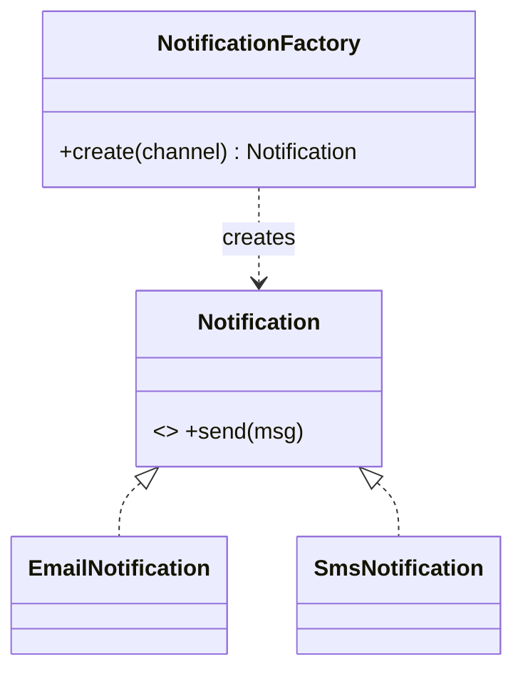

# Creational Patterns

Concern: **how objects get created** — decouple the client from the concrete instantiation.

---

## Singleton

**Problem it solves:** exactly one instance must exist and be globally reachable — shared config, connection pool, cache manager, thread pool. Multiple copies would waste resources or corrupt shared state.

**How it works:** private constructor (nobody can `new` it) + a static accessor that returns the one cached instance.

```java
public class ConfigManager {
    private static volatile ConfigManager instance;   // volatile is mandatory
    private ConfigManager() {}                          // private ctor

    public static ConfigManager getInstance() {
        if (instance == null) {                         // 1st check (no lock, fast path)
            synchronized (ConfigManager.class) {
                if (instance == null) {                 // 2nd check (inside lock)
                    instance = new ConfigManager();
                }
            }
        }
        return instance;
    }
}
```

> [!warning] Double-checked locking traps
> - `volatile` is **not optional** — without it, instruction reordering can publish a *partially constructed* object to another thread.
> - Check `null` **twice**: once outside the lock (skip locking once initialized), once inside (win the race).

**Cleaner alternatives (prefer these when asked "better way?"):**

```java
// Eager — simplest, thread-safe by classloader, wastes memory if never used
private static final ConfigManager INSTANCE = new ConfigManager();

// Bill Pugh holder idiom — lazy + thread-safe, NO synchronization needed
private static class Holder { static final ConfigManager INSTANCE = new ConfigManager(); }
public static ConfigManager get() { return Holder.INSTANCE; }

// enum Singleton — Effective Java's pick; serialization + reflection safe
public enum Config { INSTANCE; }
```

**Spring angle:** Spring's default bean scope IS singleton — **one instance per `ApplicationContext`** (not per JVM). Eagerly created at startup, single-threaded, then cached → no locking needed. You rarely hand-write a Singleton in Spring; you let the container own it.

> [!danger] Singleton is often an anti-pattern
> Global mutable state, hidden dependencies, hard to unit-test (can't mock a static). Interviewers *want* you to say "in Spring I'd use a singleton-scoped bean instead of a hand-rolled Singleton."

| When to use | When NOT to use |
|---|---|
| Genuinely one shared resource (pool, cache, config) | You just want global access (use DI instead) |
| Stateless or carefully-synchronized shared state | Mutable per-request state → race conditions |
| — | Testability matters (static blocks mocking) |

**Typical interview Qs**
- Write a thread-safe Singleton → double-checked locking + why `volatile`.
- Why is `enum` the best Singleton? → serialization- & reflection-safe by construction.
- How does Spring make singletons thread-safe without locks? → created once at startup, cached; you must still keep bean *state* thread-safe.

> Mnemonic: **Singleton = "one instance, private ctor, static gate."**

---

## Factory Method

**Problem it solves:** client needs an object but **shouldn't know / decide the concrete class** — the concrete type depends on runtime input, config, or environment. Avoids `new ConcreteX()` scattered through code (which breaks Open/Closed when a new type appears).

**How it works:** expose a creation method that returns the abstract type; the method (or a subclass) picks the concrete class.

```java
interface Notification { void send(String msg); }
class EmailNotification implements Notification { public void send(String m){ /*...*/ } }
class SmsNotification   implements Notification { public void send(String m){ /*...*/ } }

class NotificationFactory {
    static Notification create(String channel) {
        return switch (channel) {
            case "EMAIL" -> new EmailNotification();
            case "SMS"   -> new SmsNotification();
            default      -> throw new IllegalArgumentException(channel);
        };
    }
}
// client never sees concrete classes:
Notification n = NotificationFactory.create(userPref);
n.send("hi");
```



> [!note] Factory Method vs Abstract Factory
> - **Factory Method** — one product, creation deferred to a method/subclass.
> - **Abstract Factory** — a *family* of related products created together (e.g. `UIFactory` → `Button` + `Checkbox` + `Menu` all matching one theme).

| When to use | When NOT to use |
|---|---|
| Concrete type decided at runtime | Only ever one implementation |
| Want to add new types without touching callers | Creation is trivial `new` with no logic |
| Centralize construction logic / validation | Over-abstracting a stable, single-type case |

**Typical interview Qs**
- Factory vs `new`? → decouples client from concrete class; single place to change.
- Real JDK example? → `Calendar.getInstance()`, `NumberFormat.getInstance()`, `LocalDate.of(...)`.

> Mnemonic: **Factory = "ask for the interface, don't name the class."**

---

## Builder

**Problem it solves:** constructing an object with **many optional fields** cleanly + producing it **immutable**. Kills the telescoping-constructor mess (`new Foo(a,b)`, `new Foo(a,b,c)`, `new Foo(a,b,c,d)`…) where positional args are unreadable and overloads explode.

**How it works:** a helper Builder collects fields via chained setters, then `build()` returns one immutable object (final fields, no setters after construction).

```java
public final class HttpRequest {
    private final String url;        // required
    private final String method;     // optional
    private final int timeoutMs;     // optional
    private final Map<String,String> headers; // optional

    private HttpRequest(Builder b) {
        this.url = b.url; this.method = b.method;
        this.timeoutMs = b.timeoutMs; this.headers = b.headers;
    }

    public static class Builder {
        private final String url;                 // required → in Builder ctor
        private String method = "GET";            // sensible defaults
        private int timeoutMs = 3000;
        private Map<String,String> headers = new HashMap<>();

        public Builder(String url) { this.url = url; }
        public Builder method(String m)      { this.method = m; return this; }   // return this → chain
        public Builder timeout(int ms)       { this.timeoutMs = ms; return this; }
        public Builder header(String k,String v){ headers.put(k,v); return this; }
        public HttpRequest build()           { return new HttpRequest(this); }
    }
}

// usage — named, optional, immutable result:
HttpRequest r = new HttpRequest.Builder("https://api.x")
        .method("POST").timeout(5000).header("Auth","tok").build();
```

> [!tip] Why Builder over telescoping constructor (Java-specific)
> - Named, chainable → readable, no "which arg was which?".
> - Optional fields stay optional without constructor overload explosion.
> - Enforces **immutability** — object built once, no setters afterward.
> - Can validate inside `build()` before returning.

| When to use | When NOT to use |
|---|---|
| 4+ fields, several optional | 1–2 fields → plain constructor |
| Want immutable objects | Object must stay mutable anyway |
| Complex validation before construction | Simple DTO (use a record / Lombok) |

**Typical interview Qs**
- Factory vs Builder difference in *intent*? → **Factory = which class to instantiate (polymorphic creation). Builder = how to assemble one known complex object (staged construction).**
- JDK/library examples? → `StringBuilder`, `Stream.Builder`, `HttpRequest.newBuilder()` (Java 11 HttpClient), Lombok `@Builder`.

> Mnemonic: **Builder = "step-by-step assembly → immutable result."**

---

## Section recap

| Pattern | One-liner |
|---|---|
| Singleton | One instance, private ctor, static gate |
| Factory | Ask for interface, hide the concrete class |
| Builder | Staged assembly of one complex immutable object |

> [!note] The classic confusion set
> **Factory picks the class. Builder assembles the object. Singleton limits the count.**
