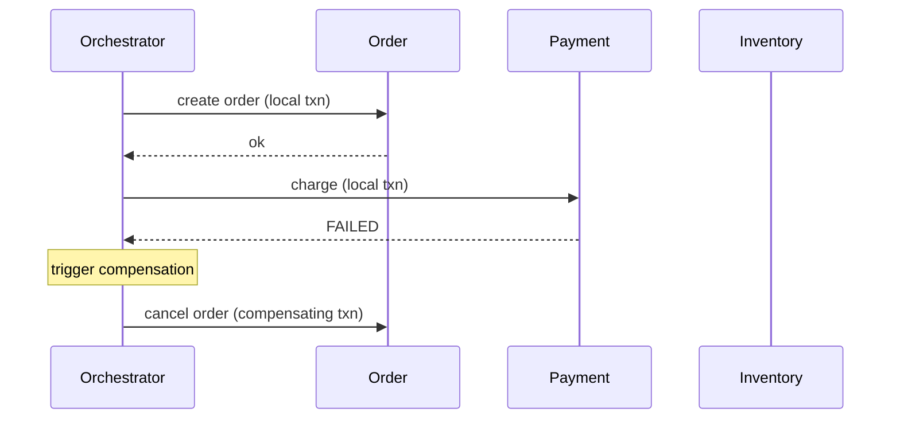
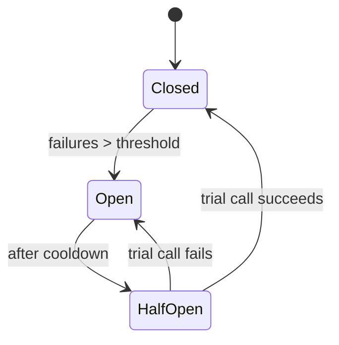
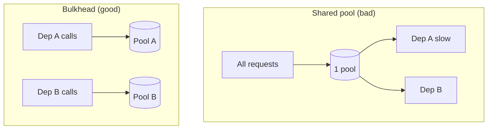
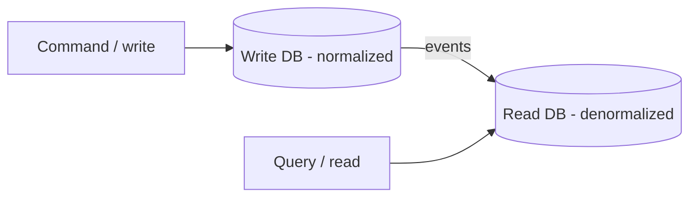
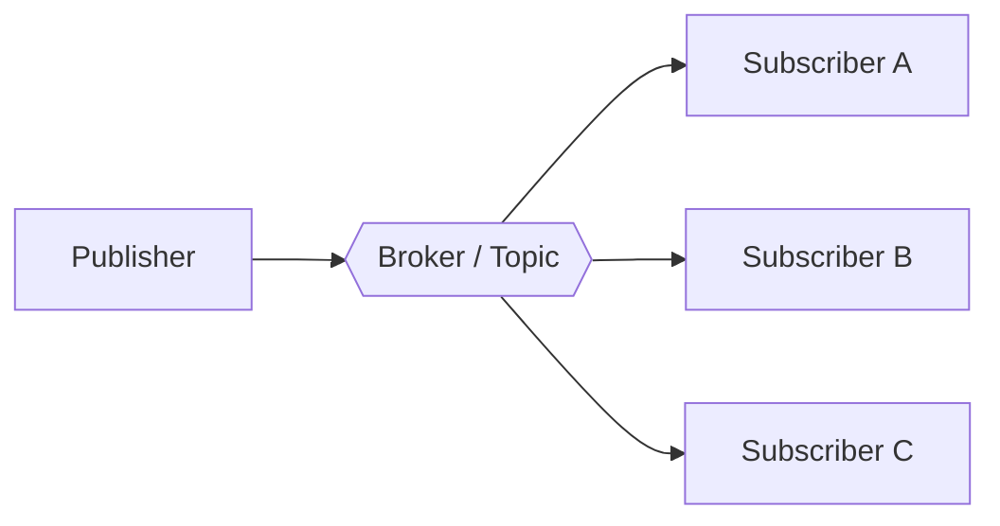
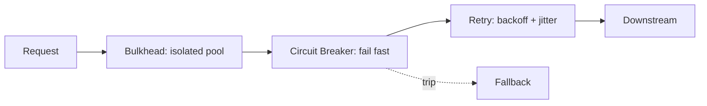

# Distributed / Architecture Patterns

Concern: **resilience, consistency, and structure across services**. These are what Moody's probes on the HLD/project round (Saga confirmed asked; CAP tied to it).

---

## Saga ⭐ (confirmed asked)

**Problem it solves:** a business transaction spans **multiple services / databases**, so a single ACID transaction (or 2-phase commit) can't cover it — 2PC locks resources across services and doesn't scale. Need consistency **without** a distributed lock.

**How it works:** break the transaction into a **sequence of local transactions**, one per service. Each local commit publishes an event/triggers the next step. If a step fails, run **compensating transactions** to semantically undo the prior committed steps (you can't roll back a committed remote txn — you *reverse* it).

**Two coordination styles:**

| | Choreography | Orchestration |
|---|---|---|
| Control | Each service listens for events & reacts — no central brain | A central **orchestrator** tells each service what to do next |
| Pros | Loose coupling, no SPOF coordinator | Easy to reason about, centralized logic, easier to trace |
| Cons | Hard to trace, cyclic-event risk, logic scattered | Orchestrator = extra component & responsibility |
| Use when | Few steps, simple flow | Many steps / complex flow |



```java
// Orchestration sketch — compensations run in reverse on failure
class OrderSaga {
    void execute(Order order) {
        try {
            orderSvc.create(order);        // step 1
            paymentSvc.charge(order);      // step 2
            inventorySvc.reserve(order);   // step 3
        } catch (Exception e) {
            // compensate in REVERSE order of what succeeded
            inventorySvc.release(order);   // undo 3
            paymentSvc.refund(order);      // undo 2
            orderSvc.cancel(order);        // undo 1
        }
    }
}
```

> [!danger] Saga ≠ rollback
> A compensating transaction is a **new action that reverses effects** (refund, release, cancel) — not a DB rollback. Side effects already committed/visible (emails sent, stock decremented) must be explicitly undone. Design compensations to be **idempotent** and tolerate partial failure.

> [!tip] Project mapping
> My cross-region migration keeps data consistent across services **without a global transaction** — reconciliation + compensating corrections is Saga-flavored thinking. Pair with **CAP**: during traffic shift I favor **availability + eventual consistency**, with reconciliation to prevent stale reads.

| When to use | When NOT to use |
|---|---|
| Multi-service business txn, need consistency | Single-DB txn → just use ACID |
| Long-running workflows | Strong immediate consistency required |
| High availability > strict consistency | Compensations impossible (irreversible acts) |

**Interview Qs**
- Saga vs 2PC? → 2PC = synchronous, locking, blocking coordinator, poor availability; Saga = async, non-locking, eventual consistency via compensations.
- Choreography vs orchestration? → table above.
- How guarantee correctness? → idempotent steps + idempotent compensations + a saga log to know how far you got.

> Mnemonic: **Saga = "local commits + compensations fake atomicity across services."**

---

## Circuit Breaker

**Problem it solves:** a downstream dependency is failing/slow; naive retries pile up, threads block, failure **cascades** upstream. Stop calling a known-bad service and **fail fast**.

**How it works:** a state machine wrapping the call.



- **Closed** — calls pass through; count failures.
- **Open** — trip: reject immediately (fail fast / fallback), don't even try, for a cooldown.
- **Half-Open** — after cooldown, let one trial through; success → Closed, failure → Open again.

```java
// conceptual — in practice use Resilience4j
if (breaker.state() == OPEN) return fallback();     // fail fast
try {
    Response r = downstream.call();
    breaker.recordSuccess();
    return r;
} catch (Exception e) {
    breaker.recordFailure();                        // may trip to OPEN
    return fallback();
}
```

> [!danger] Circuit Breaker vs Retry
> **Retry** = "try again, probably transient." **Circuit Breaker** = "stop trying, it's known down." Used **together**: retry (with backoff) for individual blips, breaker as the outer guard so you don't retry-storm a dead service.

| When to use | When NOT to use |
|---|---|
| Remote calls that can fail/slow | Purely local, in-memory calls |
| Prevent cascading failure | Failures are always permanent (no recovery to detect) |

**Interview Qs** — library? → **Resilience4j** (Hystrix is legacy). Fallback strategies? → cached value, default, queue for later, degrade gracefully.

> Mnemonic: **Circuit Breaker = "trip open, fail fast, test recovery."**

---

## Retry (+ backoff + jitter)

**Problem it solves:** **transient** failures (network blip, momentary throttle, brief unavailability) shouldn't fail the whole request — retrying often succeeds.

**How it works:** re-attempt N times with **exponential backoff** (wait 1s, 2s, 4s…) + **jitter** (randomize) to avoid a synchronized retry stampede ("thundering herd").

```java
int attempt = 0, max = 3;
while (true) {
    try { return downstream.call(); }
    catch (TransientException e) {
        if (++attempt >= max) throw e;
        long backoff = (1L << attempt) * 100;                  // 200,400,800ms
        long jitter  = ThreadLocalRandom.current().nextLong(50);
        sleep(backoff + jitter);
    }
}
```

> [!warning] Only retry idempotent operations
> Retrying a non-idempotent write (charge card, send message) can double-apply. Make the op idempotent (idempotency key / dedup) **before** retrying. Ties to my **SQS + DLQ**: at-least-once delivery → consumers must be idempotent; poison messages land in the DLQ after `maxReceiveCount`.

| When to use | When NOT to use |
|---|---|
| Transient, retryable failures | Deterministic errors (400/validation) — won't fix |
| Idempotent operations | Non-idempotent writes without dedup |

> Mnemonic: **Retry = "again, with exponential backoff + jitter, only if idempotent."**

---

## Bulkhead

**Problem it solves:** one slow/failing dependency exhausts a **shared** thread pool / connection pool, starving everything else. (Named after ship compartments — one flooded compartment doesn't sink the ship.)

**How it works:** isolate resources **per dependency** — separate thread pools / connection pools / semaphores — so a failure is contained.



| When to use | When NOT to use |
|---|---|
| Multiple independent downstreams | Single dependency |
| One slow dep must not sink others | Resource overhead of many pools not worth it |

**Interview Qs** — combine with Circuit Breaker + Retry as a resilience stack (Resilience4j provides all three).

> Mnemonic: **Bulkhead = "isolate resources so one flood doesn't sink the ship."**

---

## CQRS (Command Query Responsibility Segregation)

**Problem it solves:** read and write workloads differ wildly (read-heavy skew, different shapes) and one model serves both badly. Separate them.

**How it works:** **Command** side (writes) uses a normalized write model; **Query** side (reads) uses a read-optimized model/store, kept in sync (often async via events).



| When to use | When NOT to use |
|---|---|
| Huge read/write asymmetry | Simple CRUD → massive overkill |
| Reads need different shape than writes | Team can't handle eventual consistency |
| Pairs with Event Sourcing | Strong read-after-write needed everywhere |

> [!warning] CQRS adds eventual consistency between write and read stores — the read side lags. Don't reach for it unless the asymmetry justifies the complexity.

> Mnemonic: **CQRS = "separate the read model from the write model."**

---

## Event Sourcing

**Problem it solves:** you need a full **audit trail** / ability to reconstruct past state / temporal queries — but a mutable current-state row destroys history.

**How it works:** store state as an **append-only log of immutable events**; current state = **replay** the events. Snapshots optimize replay.

```
Account events:  Opened(100) → Withdrew(30) → Deposited(50)
Current balance = replay = 120
```

| When to use | When NOT to use |
|---|---|
| Audit/compliance, temporal queries | Simple CRUD, no history need |
| Reconstruct state at any point | Team unfamiliar — high complexity |
| Pairs with CQRS | Storage of full event log is prohibitive |

> [!note] Often paired with CQRS: events are the write log; projections build read models.

> Mnemonic: **Event Sourcing = "store the events, replay for state."**

---

## Repository

**Problem it solves:** domain/business logic shouldn't be coupled to data-access details (SQL, JPA, which DB). Provide a **collection-like abstraction** over persistence.

**How it works:** an interface exposes domain-oriented methods (`findById`, `save`); the implementation hides the query mechanics.

```java
interface OrderRepository {                 // domain sees this
    Optional<Order> findById(Long id);
    List<Order> findByStatus(Status s);
    Order save(Order o);
}
// Spring Data JPA IS this pattern — you just declare the interface:
interface OrderRepo extends JpaRepository<Order, Long> {
    List<Order> findByStatus(Status s);     // derived query, impl generated
}
```

| When to use | When NOT to use |
|---|---|
| Decouple domain from persistence | Trivial app, no domain layer |
| Swap/mocking DB in tests | Adds a layer with no benefit for simple scripts |

> Mnemonic: **Repository = "collection-like façade over the datastore."** (Spring Data JPA = built-in Repository.)

---

## Publish-Subscribe

**Problem it solves:** producers and consumers must be **fully decoupled**, async, and scale independently — fan-out events across services.

**How it works:** publisher sends to a **broker/topic**; subscribers receive independently. Publisher doesn't know subscribers (contrast **Observer** = in-process direct calls).



> [!tip] Project mapping — **SQS/SNS**
> SNS = pub-sub fan-out; SQS = queue with **at-least-once** delivery → consumers must be **idempotent**; **DLQ** quarantines poison messages after `maxReceiveCount` (not a retry queue). Visibility timeout hides an in-flight message so it isn't double-processed.

| Delivery semantics | Meaning |
|---|---|
| At-most-once | May lose, never duplicate |
| **At-least-once** | Never lose, **may duplicate** → need idempotency (SQS default) |
| Exactly-once | Ideal, expensive/hard; usually = at-least-once + dedup |

> Mnemonic: **Pub-Sub = "broker in the middle, publisher & subscriber never meet."**

---

## API Gateway

**Problem it solves:** clients shouldn't call dozens of microservices directly (chatty, exposes internals, duplicated auth). One entry point.

**How it works:** single door that **routes, aggregates, authenticates, rate-limits, terminates TLS** in front of backend services. (Distributed embodiment of **Facade**.)

| Does | Note |
|---|---|
| Routing | path/host → service |
| Auth / rate-limit / TLS | cross-cutting, done once |
| Aggregation | combine several service calls |

> [!note] API Gateway vs Load Balancer
> LB spreads traffic across **identical** instances (L4/L7, no app logic). Gateway routes across **different** services + adds app-level concerns. My **ALB** fronting the OPF fleet is the LB; a gateway would add routing/auth logic on top.

> Mnemonic: **API Gateway = "one front door: route, auth, aggregate."**

---

## Service Discovery

**Problem it solves:** service instances come and go (autoscaling, failures, new region) — you can't hardcode IPs.

**How it works:** instances **register** in a registry; callers **look up** current locations. Client-side (caller queries registry, e.g. Eureka) or server-side (LB/DNS resolves, e.g. Route 53, AWS Cloud Map).

> [!tip] Project mapping — **Route 53** weighted/latency routing shifts traffic Dublin→Spain at the DNS layer; discovery + health checks route away from unhealthy targets.

> Mnemonic: **Service Discovery = "register on start, look up to call."**

---

## Sidecar

**Problem it solves:** cross-cutting concerns (proxying, TLS, logging, metrics, retries) shouldn't be re-implemented in every service in every language.

**How it works:** deploy a helper process **alongside** the main service (same pod/host); it intercepts network traffic and handles the concern. Basis of a **service mesh** (Envoy + Istio/Linkerd).

> [!note] Sidecar vs Proxy: a sidecar is *deployed as* a proxy per-instance — it's the Proxy pattern applied at infrastructure/deployment level for cross-cutting concerns.

> Mnemonic: **Sidecar = "companion process handles the cross-cutting plumbing."**

---

## Resilience stack — how they combine



> [!tip] Say this in the resilience question
> **Bulkhead** isolates the pool, **Circuit Breaker** trips on sustained failure, **Retry** handles transient blips inside the breaker, **Fallback** degrades gracefully. All four ship in **Resilience4j**.

## Category recap

| Pattern | Solves |
|---|---|
| Saga | Cross-service consistency w/o 2PC |
| Circuit Breaker | Stop cascading failure, fail fast |
| Retry | Transient failures |
| Bulkhead | Resource isolation |
| CQRS | Read/write model asymmetry |
| Event Sourcing | Audit trail / state replay |
| Repository | Decouple domain from DB |
| Pub-Sub | Decoupled async fan-out |
| API Gateway | Single entry: route/auth/aggregate |
| Service Discovery | Dynamic instance location |
| Sidecar | Cross-cutting infra concerns per instance |
