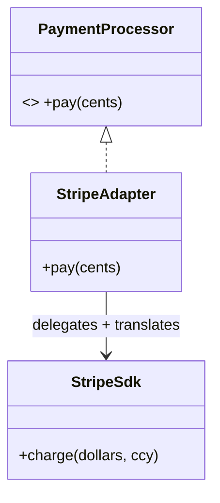
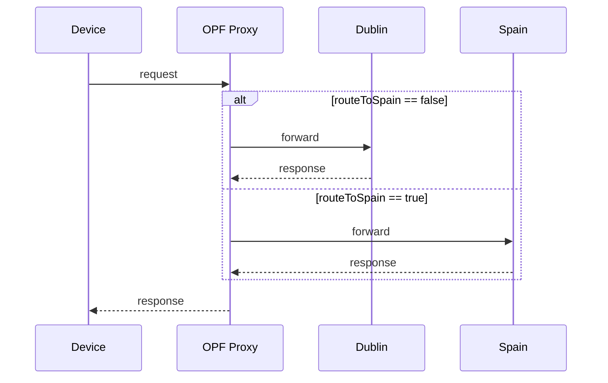
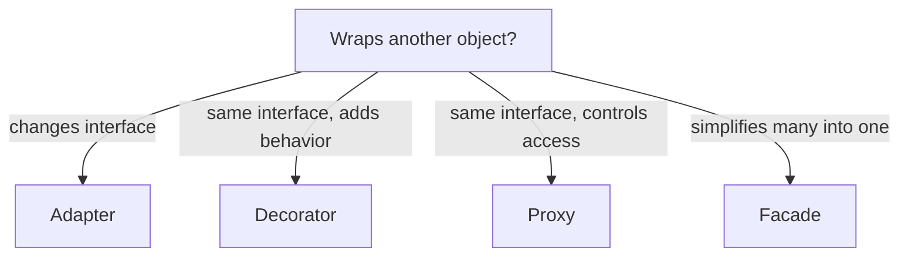

# Structural Patterns

Concern: **how objects are composed** into larger structures. Adapter, Decorator, Facade, Proxy all "wrap" another object — the distinction below is the #1 interview trap.

> [!danger] The wrapping trio — memorize the difference
> | Pattern | Same interface? | Job |
> |---|---|---|
> | **Adapter** | **No** — changes interface | Make incompatible interfaces work together |
> | **Decorator** | Yes | **Add behavior**, stackable/composable |
> | **Proxy** | Yes | **Control access** to the real object (gatekeeper, usually not stacked) |
>
> "Isn't Proxy just a Decorator?" → **No.** Decorator *adds features*; Proxy *controls access* and may add nothing but a check before forwarding.

---

## Adapter

**Problem it solves:** you must use a class whose **interface doesn't match** what your code expects — a third-party lib, a legacy API, an SDK. You can't (or won't) change either side.

**How it works:** a wrapper implements the interface the client wants and translates each call into the adaptee's actual API.

```java
// client expects this:
interface PaymentProcessor { void pay(int cents); }

// third-party SDK gives this (incompatible):
class StripeSdk { void charge(double dollars, String currency){ /*...*/ } }

// adapter bridges them:
class StripeAdapter implements PaymentProcessor {
    private final StripeSdk stripe = new StripeSdk();
    public void pay(int cents) {
        stripe.charge(cents / 100.0, "USD");   // translate the call
    }
}
```



| When to use | When NOT to use |
|---|---|
| Integrate incompatible / legacy / 3rd-party API | You control both sides → just fix the interface |
| Wrap several vendors behind one interface | No interface mismatch exists |

**Interview Qs** — JDK examples? → `Arrays.asList()` (array→List), `InputStreamReader` (bytes→chars), `Collections` view adapters.

> Mnemonic: **Adapter = "translator between two interfaces."**

---

## Decorator

**Problem it solves:** add responsibilities to an object **dynamically** without subclass explosion. Subclassing every combination (`BufferedEncryptedLoggedStream`…) is combinatorial; decorators compose at runtime.

**How it works:** decorator implements the **same interface** and holds a reference to a wrapped instance; it adds behavior before/after delegating.

```java
interface DataSource { String read(); void write(String s); }

class FileSource implements DataSource { /* base impl */ 
    public String read(){ return "raw"; } public void write(String s){} }

// base decorator holds a wrapped DataSource
abstract class SourceDecorator implements DataSource {
    protected final DataSource wrapped;
    SourceDecorator(DataSource d){ this.wrapped = d; }
}

class EncryptionDecorator extends SourceDecorator {
    EncryptionDecorator(DataSource d){ super(d); }
    public String read(){ return decrypt(wrapped.read()); }   // add behavior
    public void write(String s){ wrapped.write(encrypt(s)); }
    private String encrypt(String s){ return s; } 
    private String decrypt(String s){ return s; }
}
class CompressionDecorator extends SourceDecorator {
    CompressionDecorator(DataSource d){ super(d); }
    public String read(){ return inflate(wrapped.read()); }
    public void write(String s){ wrapped.write(deflate(s)); }
    private String inflate(String s){ return s; } 
    private String deflate(String s){ return s; }
}

// stack them — order matters:
DataSource ds = new EncryptionDecorator(new CompressionDecorator(new FileSource()));
```


> [!tip] The canonical JDK example
> `java.io` streams ARE decorators: `new BufferedReader(new InputStreamReader(new FileInputStream(f)))` — each wraps the same `InputStream`/`Reader` interface and adds one capability.

| When to use | When NOT to use |
|---|---|
| Add features in combinations, at runtime | Fixed single behavior → just subclass |
| Keep each feature isolated + composable | Deep wrapping hurts debuggability |

**Interview Qs** — Decorator vs inheritance? → inheritance is compile-time & static; decorator is runtime & composable. Order of wrapping changes behavior.

> Mnemonic: **Decorator = "same interface, wrap to add features, stackable."**

---

## Facade

**Problem it solves:** a subsystem is complex (many classes, ordering, wiring) and clients shouldn't deal with it. Provide **one simple entry point**.

**How it works:** a facade class exposes a few coarse methods and orchestrates the messy subsystem internally.

```java
class OrderFacade {                     // simple front
    private final Inventory inventory = new Inventory();
    private final Payment   payment   = new Payment();
    private final Shipping  shipping  = new Shipping();

    public void placeOrder(String item, String card) {   // one call hides 3 steps
        inventory.reserve(item);
        payment.charge(card);
        shipping.dispatch(item);
    }
}
```

> [!note] Facade vs Adapter
> Both wrap — but **Adapter** changes an interface to match an expectation; **Facade** *simplifies* many interfaces into one. Facade = simplification, Adapter = compatibility.

| When to use | When NOT to use |
|---|---|
| Hide a complex/multi-step subsystem | Subsystem is already simple |
| Decouple clients from internals | You need fine-grained control (facade hides it) |

**Interview Qs** — Facade vs API Gateway? → API Gateway is the *distributed-systems* embodiment of Facade (one entry point over many services) + adds auth/routing/rate-limiting.

> Mnemonic: **Facade = "one door over a messy house."**

---

## Proxy ⭐ (my project's OPF fleet)

**Problem it solves:** control **access** to a real object — add a gatekeeper for lazy-loading, access control, caching, logging, or **routing/indirection** — without the client knowing it's not talking to the real thing.

**How it works:** proxy implements the **same interface** as the real subject, holds a reference to it, and does work *around* the call (check/route/cache) before/after forwarding.

```java
interface RegionBackend { Response handle(Request r); }

class RealBackend implements RegionBackend {          // real service (Dublin or Spain)
    public Response handle(Request r){ /* actual work */ return new Response(); }
}

class OpfProxy implements RegionBackend {             // the proxy fleet
    private RegionBackend dublin, spain;
    private volatile boolean routeToSpain = false;    // traffic-shift switch

    public Response handle(Request r) {
        RegionBackend target = routeToSpain ? spain : dublin;   // ACCESS CONTROL / ROUTING
        log(r);                                                  // cross-cutting
        return target.handle(r);                                // forward
    }
    public void shiftTraffic(boolean toSpain){ this.routeToSpain = toSpain; } // instant rollback
    private void log(Request r){}
}
```



> [!tip] Project mapping — say this out loud
> My **OPF proxy fleet** IS the Proxy pattern: devices hit the proxy, not the backend directly; the proxy decides old-region vs new-region and can flip in seconds — **decoupling rollback speed from the 6-hour device config propagation**. At the architecture level this is also **Strangler Fig** (route traffic behind a proxy to migrate incrementally without touching clients).

**Proxy flavors:** Virtual (lazy-load expensive object), Protection (access control), Remote (stand-in for an object in another address space — RPC stubs), Caching, Logging.

| When to use | When NOT to use |
|---|---|
| Gate access: routing, auth, cache, lazy-load | No access concern → don't wrap |
| Client should be unaware of indirection | Adds a network hop / latency you can't afford |
| Add cross-cutting concerns transparently | You actually want to *add features* → Decorator |

**Interview Qs**
- Proxy vs Decorator? → Proxy controls *access* (gatekeeper), Decorator adds *behavior* (stack).
- Where does Spring use Proxy? → **AOP + `@Transactional`** create a dynamic proxy around your bean (JDK dynamic proxy / CGLIB) — hence the self-invocation trap.
- Real distributed example? → your OPF fleet; also sidecars, RPC client stubs.

> Mnemonic: **Proxy = "same interface, stands in front to control access."**

---

## Section recap



> [!note] One-line each
> **Adapter** translates · **Decorator** adds & stacks · **Facade** simplifies · **Proxy** guards access.
