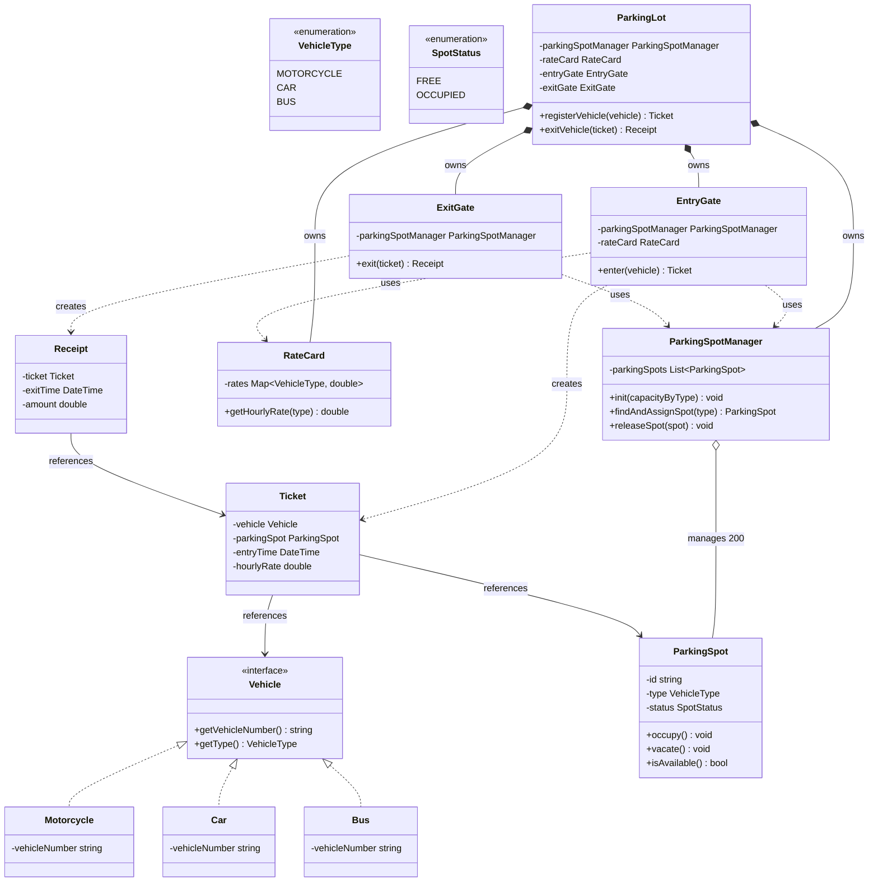

# Problem Statement (as an interviewer would give it)

Design a parking lot system.

## Requirements

1. A vehicle enters through a single entry gate and is issued a **Ticket**.
2. The ticket contains: spot number, entry time, and hourly rate (locked in at the time of entry).
3. Supported vehicle types: Motorcycle, Car, Bus — the design should be extensible to more types in the future.
4. The parking lot has a fixed spot pool per vehicle type: 50 motorcycle spots, 100 car spots, 50 bus spots (200 total).
5. Strict type matching: a vehicle can only occupy a spot of its own type — no overflow into another type's pool.
6. If no spot of the matching type is available, the vehicle is rejected at the entry gate.
7. On exit, the parking cost is calculated using the hourly rate locked on the ticket and the duration the vehicle was parked.

## Out of Scope

1. Multi-level parking.
2. Spot allocation *algorithm* — i.e., which specific empty spot within a type's pool gets assigned. (The *policy* of fixed pools per type is in scope; the assignment *strategy* is not.)
3. Payment collection.
4. Multiple exit gates.
5. Concurrency / thread-safety — single-threaded, single-gate assumption for this design.

---

# Entities & Relationships
**Entities**

- `ParkingLot` — orchestrator; owns `ParkingSpotManager`, `RateCard`, `EntryGate`, `ExitGate`
- `ParkingSpotManager` — owns the pool of `ParkingSpot`s; find/allocate a free spot of a given type, free a spot. Knows nothing about tickets, vehicles, or rates.
- `ParkingSpot` — id, type, status (`FREE` / `OCCUPIED`)
- `Vehicle` (interface) → `Motorcycle`, `Car`, `Bus`
- `Ticket` — id, vehicle reference, spot reference, entryTime, hourlyRate (locked at issue time)
- `EntryGate` — vehicle in → issues `Ticket`, or rejects if no matching spot
- `ExitGate` — ticket in → calculates cost, frees the spot
- `RateCard` — `VehicleType → hourlyRate` lookup (not a Strategy-pattern hierarchy: the cost formula `hourlyRate × hoursParked` is identical across vehicle types, only the rate value varies, so a single lookup class is the right level of complexity for now. Revisit as Strategy if a future requirement makes the formula itself diverge by type — e.g. flat daily rate for buses.)

**Relationships**
- `ParkingLot` *has-a* `ParkingSpotManager` (1)
- `ParkingLot` *has-a* `RateCard` (1)
- `ParkingLot` *has-a* `EntryGate`, `ExitGate` (1 each — single gate per scope, not a Singleton pattern)
- `ParkingSpotManager` *has-many* `ParkingSpot` (200, partitioned by type: 50 motorcycle / 100 car / 50 bus) — sole owner of spots
- `ParkingSpot` — state: status (`FREE`/`OCCUPIED`)
- `Ticket` *references* `Vehicle` and `ParkingSpot` (one-directional; `ParkingSpot` does not reference back)
- `RateCard` *has-many* `VehicleType → hourlyRate` entries
- `Vehicle` (interface) `◁--` `Motorcycle`, `Car`, `Bus`

> [!note] Why not a Strategy pattern for rates?
> Strategy earns its place when the *algorithm* varies by type, not just a *value*. Here the formula is the same for every vehicle — only the number differs — so a plain lookup (`RateCard`) is the right-sized design. Forcing Strategy now would be solving a problem that doesn't exist yet.

### Class Design

Two things to answer during class design
- State: What does this class needs to remember
- Behaviour: What operations does the outside world need, and which requirement does each satisfy.

```java
// ── Enums ─────────────────────────────────────────────
// Enums instead of raw strings: a closed set of vehicle
// types / spot statuses shouldn't be typo-able ("car" vs "Car" vs "CAR").

enum VehicleType:
	MOTORCYCLE, CAR, BUS

enum SpotStatus:
	FREE, OCCUPIED


// ── Vehicle ───────────────────────────────────────────
// Interface defines a behavior contract only — no stored fields on
// the interface itself (fields live on the implementing classes).

interface Vehicle:
	+ getVehicleNumber() -> string
	+ getType() -> VehicleType

class Motorcycle implements Vehicle:
	- vehicleNumber: string
	+ getVehicleNumber() -> string   // returns vehicleNumber
	+ getType() -> VehicleType.MOTORCYCLE

class Car implements Vehicle:
	- vehicleNumber: string
	+ getVehicleNumber() -> string
	+ getType() -> VehicleType.CAR

class Bus implements Vehicle:
	- vehicleNumber: string
	+ getVehicleNumber() -> string
	+ getType() -> VehicleType.BUS


// ── ParkingSpot ───────────────────────────────────────
// Owns its own occupancy state and the rule for changing it
// ("Tell, Don't Ask" — no external class flips this directly).

class ParkingSpot:
	- id: string                // needed so Ticket can carry a spot number (req 2)
	- type: VehicleType
	- status: SpotStatus

	+ occupy() -> void           // sets status = OCCUPIED; throws/asserts if already occupied
	+ vacate() -> void           // sets status = FREE
	+ isAvailable() -> bool      // status == FREE


// ── ParkingSpotManager ────────────────────────────────
// Owns ONLY the pool of spots. Knows nothing about tickets,
// vehicles, or rates — that separation was decided in
// Entities & Relationships and is preserved here.

class ParkingSpotManager:
	- parkingSpots: List<ParkingSpot>

	// capacityByType lets us set up 50 motorcycle / 100 car / 50 bus
	// spots distinctly, rather than one flat "size" that can't express
	// per-type pools.
	+ init(capacityByType: Map<VehicleType, int>) -> void

	// Finds the first FREE spot of the matching type, marks it occupied,
	// and returns it. Returns null if none available (caller uses this
	// to satisfy requirement 6 — reject at entry).
	+ findAndAssignSpot(type: VehicleType) -> ParkingSpot?

	// Called on exit to return a spot to the pool.
	+ releaseSpot(spot: ParkingSpot) -> void   // calls spot.vacate()


// ── RateCard ──────────────────────────────────────────
// Plain lookup, not a Strategy hierarchy — the cost formula
// (hourlyRate × hoursParked) is identical for every vehicle type,
// only the rate number differs. See note above on Strategy pattern.

class RateCard:
	- rates: Map<VehicleType, double>

	+ getHourlyRate(type: VehicleType) -> double


// ── Ticket ────────────────────────────────────────────
// Pure data holder. Carries everything requirement 2 asks for:
// spot number (via parkingSpot.id), entry time, and hourly rate
// LOCKED AT ISSUE TIME (so a later rate change never affects
// someone already parked).

class Ticket:
	- vehicle: Vehicle
	- parkingSpot: ParkingSpot   // one-directional: ParkingSpot does NOT
	                              // reference back to Ticket. The physical
	                              // ticket is what's presented at exit, so
	                              // no reverse lookup is ever needed.
	- entryTime: DateTime
	- hourlyRate: double         // copied from RateCard at issue time, not
	                              // looked up again at exit


// ── Receipt ───────────────────────────────────────────
// Small addition: a clean return type for exit, instead of a bare
// number, so it's obvious what exitVehicle() hands back.

class Receipt:
	- ticket: Ticket
	- exitTime: DateTime
	- amount: double


// ── EntryGate ─────────────────────────────────────────
// Stateless service: holds only its COLLABORATORS (manager, rate card)
// as fields, never a specific ticket/vehicle/spot — those are per-call
// data, not something a gate "remembers" between vehicles.

class EntryGate:
	- parkingSpotManager: ParkingSpotManager
	- rateCard: RateCard

	// Orchestrates entry end-to-end:
	// 1. Ask ParkingSpotManager for a free spot of this vehicle's type.
	// 2. If none available -> return null (requirement 6: reject at entry).
	// 3. Else look up the hourly rate and build the Ticket.
	+ enter(vehicle: Vehicle) -> Ticket?


// ── ExitGate ──────────────────────────────────────────
// Also stateless — only holds parkingSpotManager as a collaborator.
// (No rateCard field needed: the rate is already locked on the ticket.)

class ExitGate:
	- parkingSpotManager: ParkingSpotManager

	// Orchestrates exit end-to-end:
	// 1. Compute duration = now - ticket.entryTime.
	// 2. amount = duration (hours) * ticket.hourlyRate.
	// 3. parkingSpotManager.releaseSpot(ticket.parkingSpot).
	// 4. Return a Receipt (payment itself is out of scope — handed to
	//    an external system from here).
	+ exit(ticket: Ticket) -> Receipt


// ── ParkingLot ────────────────────────────────────────
// The orchestrator / aggregate root. Public-facing API simply
// delegates to entryGate / exitGate rather than duplicating their logic.

class ParkingLot:
	- parkingSpotManager: ParkingSpotManager
	- rateCard: RateCard
	- entryGate: EntryGate
	- exitGate: ExitGate

	+ registerVehicle(vehicle: Vehicle) -> Ticket?   // delegates to entryGate.enter(vehicle)
	+ exitVehicle(ticket: Ticket) -> Receipt         // delegates to exitGate.exit(ticket)
```

> [!tip] What changed from the earlier draft
> - `Ticket` now carries `entryTime` and `hourlyRate` (req 2 was previously unmet).
> - `ParkingSpotManager` gained the missing `findAndAssignSpot`/`releaseSpot` methods, and lost `rateCard` (rates aren't its concern).
> - `EntryGate`/`ExitGate` no longer hold a specific `ticket`/`vehicle`/`spot` as instance state — they're stateless services with only their collaborators as fields.
> - `ParkingSpot` gained an `id` and enum `type`, plus its own `occupy()`/`vacate()` behavior instead of being a passive data bag.
> - `ParkingLot`'s two public methods now clearly delegate to the gates instead of duplicating their logic.

> [!warning] Still open for the Implementation section
> - Exact duration math (partial hours — round up or bill by the minute?) isn't decided yet.
> - `occupy()`/`vacate()` calling `vacate()` on an already-free spot, or `occupy()` on an already-occupied one — should these throw, or fail silently? Worth deciding when we write pseudocode.
#### Class Diagram
> [!note] Study aid only
> Hello Interview explicitly recommends *against* drawing formal UML in the actual interview — plain class-block notation (what we used above) is faster and what they teach. This diagram is here purely as a personal reference for the finished design, not something to reproduce on a whiteboard under time pressure.



**Legend:** `*--` composition (owns, dies with parent) · `o--` aggregation (manages, independent lifecycle) · `..>` dependency (uses/creates) · `-->` reference · `<|..` interface implementation

## Retro — Requirements → Class Design

**Learnings**
- LLD entities aren't "every noun in the prompt" — filter by *does it hold changing state or enforce a rule?* Otherwise it's just a field on something else.
- Lock the orchestrator early. "X has-a Y" only means something once you know which single class drives the main workflow — this stayed vague for a while and cost time.
- A pattern (Strategy, Singleton, etc.) needs a real problem to solve. "Different rate per vehicle type" is a lookup, not a varying algorithm — Strategy would've been solving a problem that didn't exist.
- Interfaces define behavior contracts, not stored fields (`Vehicle.type: string` on the interface itself was a language-semantics mistake).
- Gate/service-style classes (`EntryGate`, `ExitGate`) should stay stateless — holding a specific `ticket`/`vehicle`/`spot` as an instance field breaks the moment a second request comes through.
- Directional references matter: `Ticket -> ParkingSpot` one-way was enough because the physical ticket is what's presented at exit — no reverse lookup needed. Adding the reverse reference back would've been unjustified complexity.
- Requirements can quietly get violated during class design even after being locked — `Ticket` was missing `entryTime`/`hourlyRate` for two full revision rounds despite requirement 2 stating it explicitly. Worth re-checking each class against the requirements list before calling a section done, not just against "does this look reasonable."

**What I did well**
- Defended early design choices with real reasoning (rate locked at entry, ticket→spot direction) instead of guessing.
- Caught some of my own gaps mid-flow (the `init(size)` comment questioning per-type capacity was a good self-catch).
- Cleaned up scope contradictions fast once flagged (payment leaking back into the exit flow was fixed immediately, no hedging).
- Iterated across multiple rounds on Class Design rather than accepting a broken first draft.

**To improve**
- State a design decision's assumption *before* being asked, not just when defending it under cross-questioning (e.g., "single-threaded, single-gate" should be said upfront, not pulled out by a follow-up).
- When told "fixed," verify the change actually landed before saying so — happened twice this session where a stated fix wasn't reflected in the file.
- In the last few rounds, moved from independently reasoning through gaps to asking for the fix directly. Good for first-pass learning, but note: this section would score as *interviewer-assisted*, not independent, in a real interview — the goal next time is to close gaps like "missing method," "wrong return type," "field that violates a locked separation" without needing the corrected code handed over.

**Recurring issue pattern**
- The most common mistake type across this session wasn't *not knowing* LLD principles — it was **inconsistency between stated decisions and written design** (e.g., agreeing `ParkingSpotManager` shouldn't know about rates, then giving it a `rateCard` field anyway; agreeing on one-directional `Ticket -> ParkingSpot`, then adding the reverse reference back). Treat every previously locked decision as a constraint to check new code against, not just a note taken and moved past.

